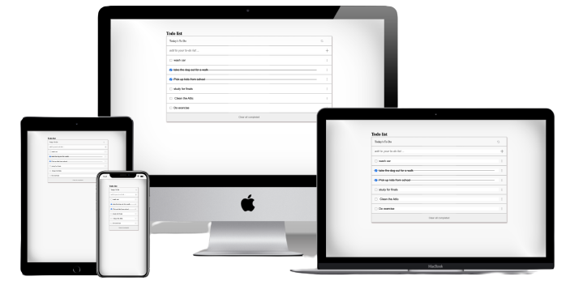

# Project Name

> To-do list.

## Built With

- HTML, CSS, JavaScript
- Webpack

## Live Demo (if available)

[Live Demo Link](https://shella12.github.io/to-do-list.github.io/)

## Authors

👤 **Author1**

- GitHub: [@githubhandle](https://github.com/shella12)
- Twitter: [@twitterhandle](https://twitter.com/AyeshaA03712974)
- LinkedIn: [LinkedIn](https://www.linkedin.com/in/ayesha-arshad-a690a015a/)

## 🤝 Contributing

Contributions, issues, and feature requests are welcome!

Feel free to check the [issues page](../../issues/).

## Show your support

Give a ⭐️ if you like this project!

## 📝 License

This project is [MIT](./LICENSE) licensed.

_NOTE: we recommend using the [MIT license](https://choosealicense.com/licenses/mit/) - you can set it up quickly by [using templates available on GitHub](https://docs.github.com/en/communities/setting-up-your-project-for-healthy-contributions/adding-a-license-to-a-repository). You can also use [any other license](https://choosealicense.com/licenses/) if you wish._
